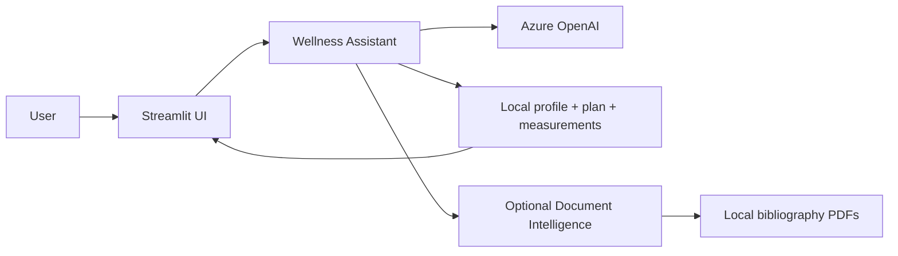

# Personal Wellness AI Assistant

A **local-first Streamlit application** for planning weekly routines, meals, personal measurements, and wellness-oriented conversations with an Azure OpenAI assistant.

The project is designed as an applied AI portfolio example: user data stays in local files, Azure services are optional/configurable, and the public repository contains only synthetic examples.

> This application supports everyday wellness planning. It is not a medical, nutritional, or sports diagnosis tool and does not replace qualified professional advice.

## What it demonstrates

- conversational AI with **Azure OpenAI**
- optional PDF extraction with **Azure Document Intelligence**
- local-first personal state stored in CSV / JSON / YAML
- editable weekly meal and activity plans
- measurement tracking and lightweight progress visualization
- private configuration separated from source control
- testable assistant logic with injectable external clients
- Streamlit UI
- automated tests and GitHub Actions CI

## Architecture



The core application is intentionally local-first. Personal configuration and measurements are excluded from Git and are never required for the public demo configuration.

## Project structure

```text
.
├── app.py
├── assistant.py
├── config_usuario.example.yaml
├── mediciones.example.csv
├── plan_semanal.example.csv
├── historial_chat.example.json
├── historial_cambios.example.csv
├── .env.example
├── pyproject.toml
└── tests/
```

## Setup

Requires Python 3.11+.

```bash
python -m venv .venv
source .venv/bin/activate        # macOS/Linux
# .venv\Scripts\activate       # Windows

pip install -e ".[dev]"
cp .env.example .env
cp config_usuario.example.yaml config_usuario.yaml
```

Configure the Azure OpenAI variables in `.env` and run:

```bash
streamlit run app.py
```

If `config_usuario.yaml` is missing, the application falls back to the synthetic example configuration so the public project can still start in demo mode.

## Private local data

The following files are intentionally ignored by Git:

- `.env`
- `config_usuario.yaml`
- `mediciones.csv`
- `plan_semanal.csv`
- `historial_chat.json`
- `historial_cambios.csv`
- `bibliografia_dietas/`

The repository includes only example files with synthetic values.

## Azure OpenAI

The assistant uses an explicit `AzureOpenAI` client rather than global SDK configuration.

Required variables:

```dotenv
AZURE_OPENAI_ENDPOINT=...
AZURE_OPENAI_API_KEY=...
AZURE_OPENAI_DEPLOYMENT_NAME=...
AZURE_OPENAI_VERSION=...
```

External clients are injectable, which allows the core behavior to be unit-tested without making API calls.

## Optional document context

A local `bibliografia_dietas/` directory can contain text, image, or PDF resources.

For PDF text extraction, configure Azure Document Intelligence:

```dotenv
AZURE_DOCUMENT_INTELLIGENCE_ENDPOINT=...
AZURE_DOCUMENT_INTELLIGENCE_KEY=...
AZURE_DOCUMENT_INTELLIGENCE_API_VERSION=2024-11-30
```

PDF analysis is treated as an asynchronous operation and polls the returned operation URL until completion.

## Measurements

The maintained schema supports:

```text
fecha, cintura, cadera, muslo, peso, altura
```

The modernization fixes two inconsistencies in the earlier implementation:

- the UI supplied weight and height but the storage method did not accept them
- measurement loading removed weight and height before the UI could calculate BMI

The public example data is synthetic.

## Quality checks

```bash
ruff check assistant.py tests
pytest -q
```

Tests cover:

- fallback to the public example configuration
- measurement persistence including weight and height
- editing previously saved measurements
- injected/mock Azure OpenAI calls
- safety instructions passed to the model

No Azure request is made in CI.

## Current scope

This is an applied AI assistant and personal productivity/wellness project, not a clinically validated system.

Useful next additions would be:

- structured model output instead of extracting menu JSON from free text
- explicit schema validation for imported local files
- a screenshot/demo using synthetic data
- optional encrypted local persistence
- a small end-to-end Streamlit smoke test
